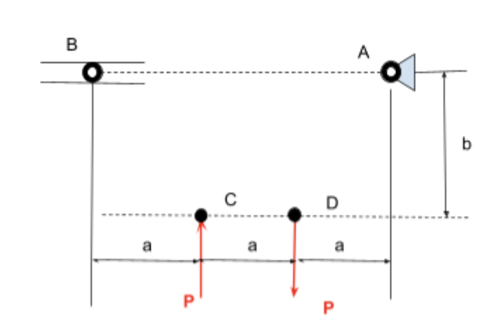
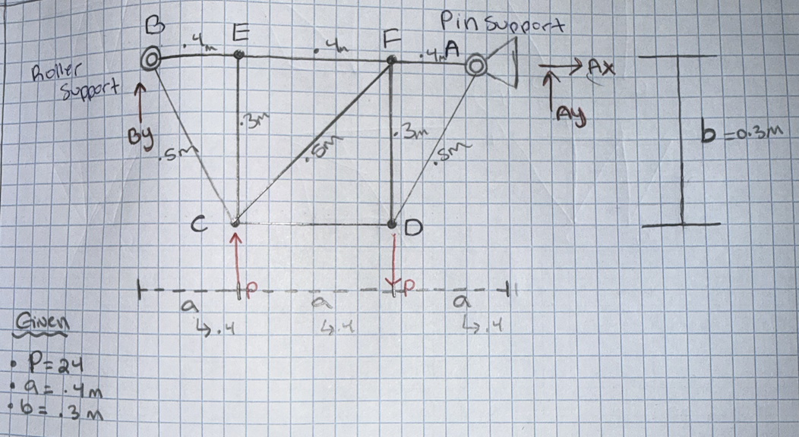
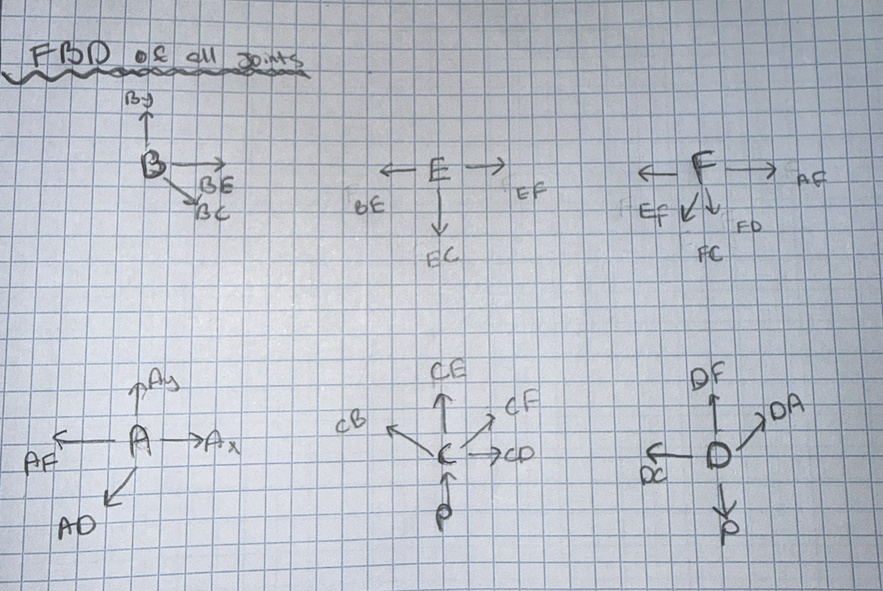
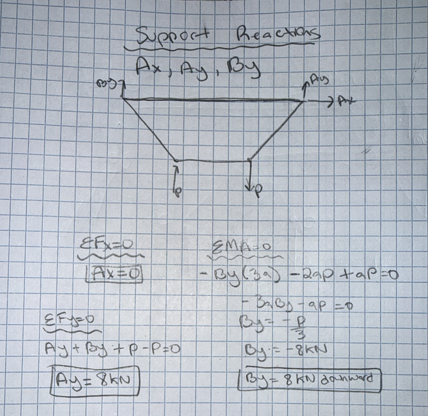

# A2 – Truss Stress Analysis

# Constraints 

For this assignment, I was tasked with creating a truss that fits the constraints below. 

 

Point A is a pin while point B is a roller. The length of a is, a=.4m. The height of b is, b=.3m. I was given the choice to chose a number between 20-30 for P. I chose P=24kN. 

The design process started by assigning geometry to the structure. I decided to go with a simple design and add 2 more connecting points to maximize structural support. Point E an point F. 

The lengths of members CD, BE, EF, and FA equal .4m. Members EC and FD have a length equal to .3m. To determine the diagonal member lengths, which includes, BC, AD, CF, I used pythagorean theorem. L is equal to the square root of x^2 + y^2. I found that the length is equal to .50m. 

I drew free body diagrams for all 6 joints to be able to visualize how the forces act on one another. 

The next step in this design process was to calculate all the external forces acting on the truss. Point B is a roller point so there is a reaction on the Y direction. Point A is pin support so there is a reaction in the Y and x direction. 

After I found all the internal forces, identified the member with the greates internal force. Using that member, I then found an equation to find the cross sectional area. It is used to ensure that the structure can safley support the calculated internal forces withouth yielding. From the joints of anaylsis, member CF experienced the alrgest internal force of 26.67 kn in compression. This force was used as the controlling load of the design. A factor of saftey of 3.5 was applied to the yeild strength of the selecte A500 structural steel, and the minimum required cross sectional area was calulated using the allowable normal stess equation. 

**Figure: Cross sectional area** 

ASTM A500 Grade C structural steel was slecte for the truss design. A yeild strength of 345 MPa was used based on published AISC meterial properties for rectuangular A500 Grade C HSS. Using the maximum calculated member force of 26.67 kN and the required factor of saftey of 3.5, the minimum cross-sectional area was calculated to be 270.8 mm^2. 

The approximate weight of the truss was determined using the total length of all truss members, the minium required cross-sectinoal area, and the density of strucuarl steel. The lengths of all members were added to obtain a total member length of 3.7m and a steel density of 7850 kg/m^3 was used. Using the calulated cross sectiional area of 270.6mm^2, the truss has an approximate mass of 7.86kg, corresponding to a weight of approximately 77.1 N. 

## Objective

## Analyze

## Decide
_Which geometry did you select, and why? This is your first open design choice in the course — defend it._

## Communicate

